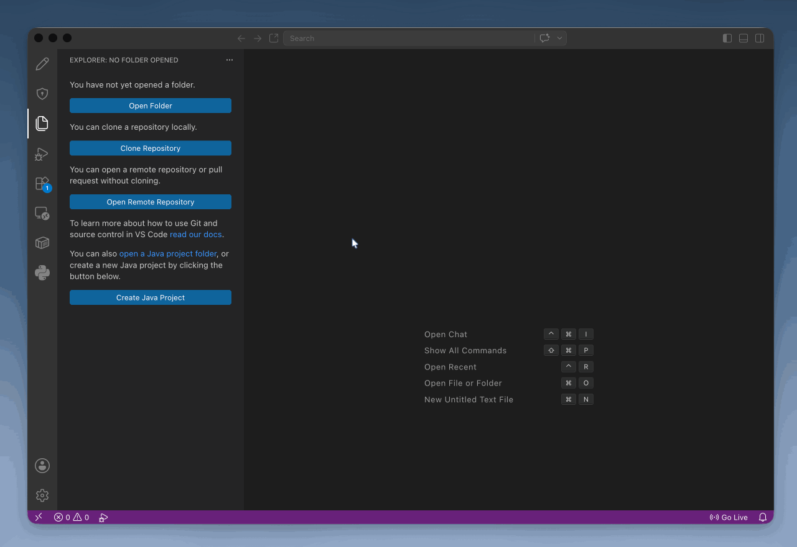

============================
2. Installing MARV Extension
============================

Currently, MARV is delivered directly as a Visual Studio Code extension package file (.vsix). Follow the steps below to install it manually.

Installation Steps
------------------

1. Download the official MARV extension package file (e.g., marv-extension.vsix) from the module area on blackboard. This can be found within the "Teaching and Development Environments" section.
2. Open **Visual Studio Code**.
3. Click the **Extensions Icon** on the primary sidebar on the left (or press Cmd+Shift+X on macOS / Ctrl+Shift+X on Windows/Linux).
4. Click the **Views and More Actions** menu (the ... icon) in the top-right corner of the Extensions panel.
5. Select **Install from VSIX...** from the drop-down menu.
6. Browse to the location of your downloaded .vsix file, select it, and click **Install**.

Verification
------------

Upon successful installation, a popup notification will appear in the bottom-right corner of VS Code stating:

.. code-block:: text

   Completed Installing Extension: MARV Tutorials

You will also notice the new **MARV Icon** appearing in your VS Code primary sidebar.
