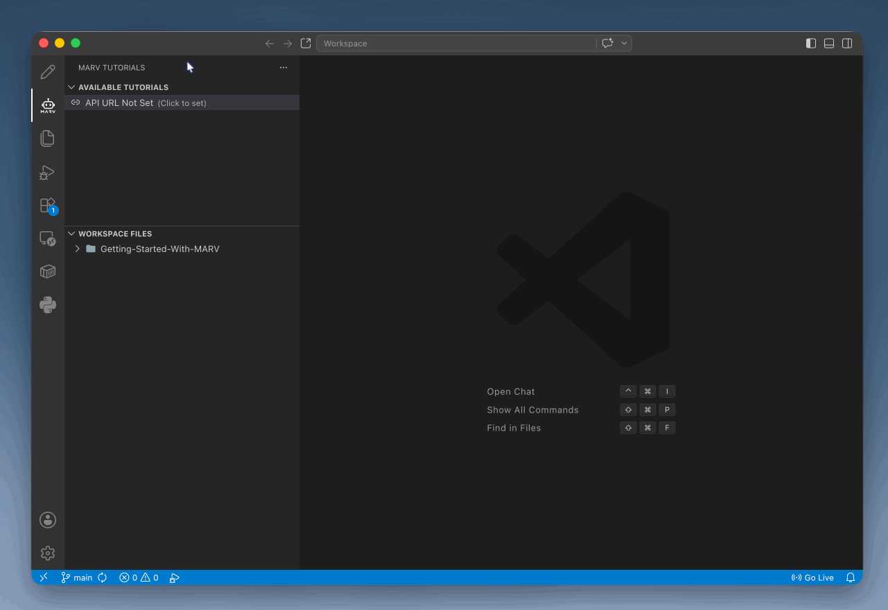

=============================
3. Setting the MARV API URL
=============================

To fetch tutorials, module lists, and automated verifications, MARV requires a connection to your institution's MARV API server.

Configuring the API Endpoint
----------------------------

1. Open the MARV extension sidebar in VS Code.
2. If the API URL has not been configured yet, you will see a status banner stating:

   API URL Not Set (Click to set)

3. Click on the status banner text.
4. An input box will appear at the top of VS Code. Enter the official server URL:

.. code-block:: text

   https://marv.computing.edgehill.ac.uk

5. Press Enter to save the setting.

.. tip::
   **Troubleshooting Endpoint Connection:** If your tutorials fail to load, verify that your computer is connected to the internet or campus network and ensure there are no trailing slashes in the API URL.
