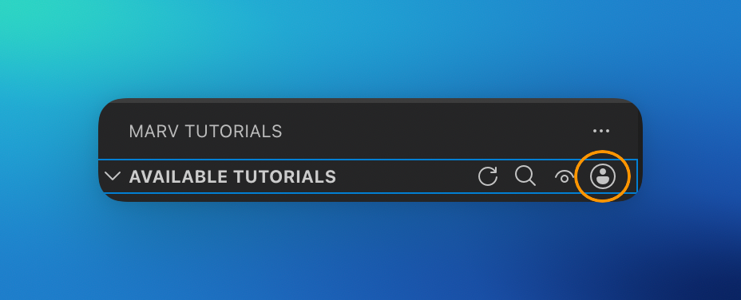
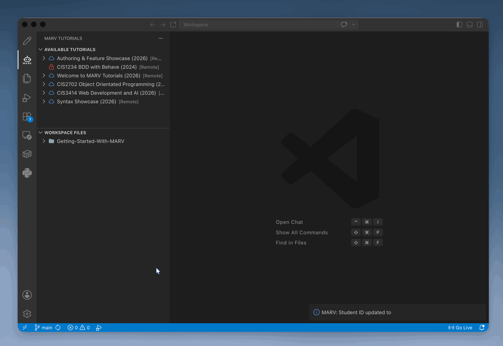

==============================
4. Configuring Student ID
==============================

To track your module progress, record completed assessments, and submit lab verifications, you must configure your Student Identification Number.

Setting Your Student ID
-----------------------

1. In the MARV sidebar, hover your mouse over the **Available tutorials** header text.
2. A series of action icons will be revealed on the right side of the header.
3. Click the **User Icon** (the rightmost icon circled in red below).

4. An input prompt will appear at the top of your editor screen:

   Inputting Student ID...

5. Type your official Student ID number and press Enter.

.. important::
   **Accuracy Matters:** Ensure your Student ID is entered correctly. Your progress logs and automated assessment scores are linked to this ID for academic credit.
