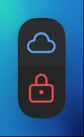

==============================
5. Interface & Viewer Overview
==============================

Once your API URL and Student ID are configured, the MARV sidebar automatically refreshes to display your available course modules.

Module Availability Indicators
-------------------------------

Modules in MARV display status icons indicating accessibility:

* **Cloud Icon (☁️):** Openly Available Module. You can click to expand and access all tutorials immediately.
* **Lock Icon (🔒):** Passcode-Protected Module. Requires an access passcode supplied by your tutor during lab sessions.

.. image:: ../_static/images/available_tutorials.png
   :alt: Available Modules List
   :align: center
   :width: 750px

Structural Hierarchy
--------------------

Content inside MARV is structured hierarchically into three levels:

.. code-block:: text

   Module  (e.g., Welcome to MARV Tutorials)
   └── Tutorial  (Folder Icon)
       └── Pages  (White Arrow items)

1. **Module:** Represents a course unit or topic collection.
2. **Tutorial:** Represented by a **Folder Icon**, grouping related lessons together.

.. image:: ../_static/images/module_structure.png
   :alt: Module Structure Hierarchy
   :align: center
   :width: 750px

3. **Pages:** Organised step-by-step lessons guiding you through the tutorial.

.. image:: ../_static/images/tutorial_pages.png
   :alt: Tutorial Pages List
   :align: center
   :width: 750px

Opening Pages in the Viewer
----------------------------

Click on any **Page** (marked by a white arrow in the list). Its contents will render instantly in the primary MARV Viewer Pane (indicated by the orange arrow below).

.. image:: ../_static/images/page_and_viewer.png
   :alt: Page Selection and Viewer Output
   :align: center
   :width: 800px
