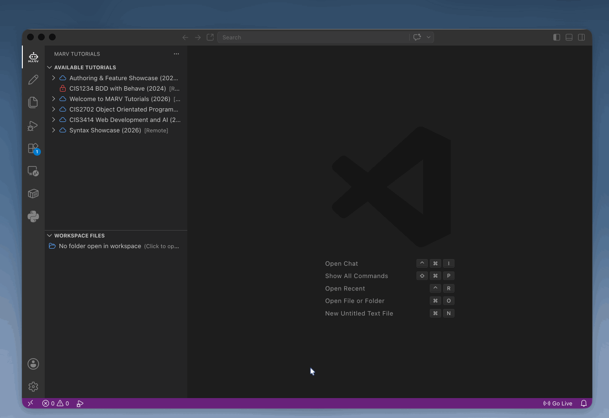
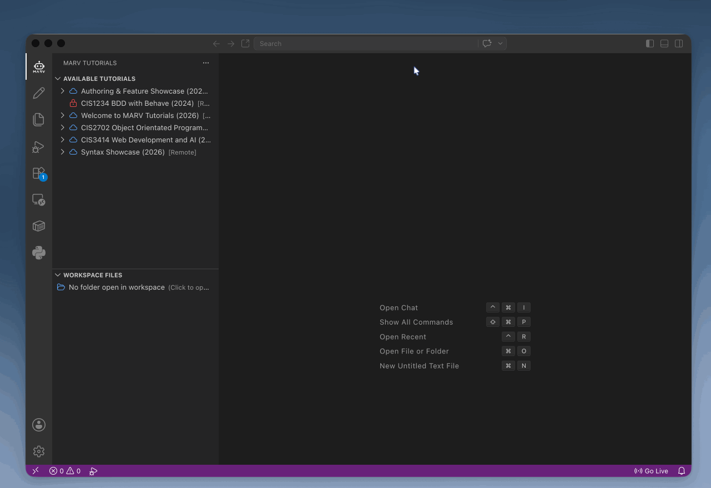

===============================
6. Managing Workspace Files
===============================

When working through interactive tutorials, having an active workspace folder open in VS Code is essential so that automated test scripts, starter files, and code edits function properly.

Methods to Open a Workspace
---------------------------

MARV offers two convenient methods to open your project workspace:

Method 1: Direct Link in MARV Sidebar
~~~~~~~~~~~~~~~~~~~~~~~~~~~~~~~~~~~~~

If no folder is currently open in VS Code, MARV displays a prominent prompt:

No folder open in workspace (Click to open)

Clicking this text opens a native file browser window allowing you to select or create your working directory.

Method 2: Primary Sidebar Explorer
~~~~~~~~~~~~~~~~~~~~~~~~~~~~~~~~~~

Alternatively, you can open a workspace using standard VS Code navigation:

1. Click the **Explorer Icon** in the top-left of the primary sidebar (or press Cmd+Shift+E / Ctrl+Shift+E).
2. Click **Open Folder...** and choose your desired course directory.

Summary
-------

Both methods achieve the same goal: establishing a root workspace directory where MARV can clone repository templates, open code files, and execute verification scripts.
