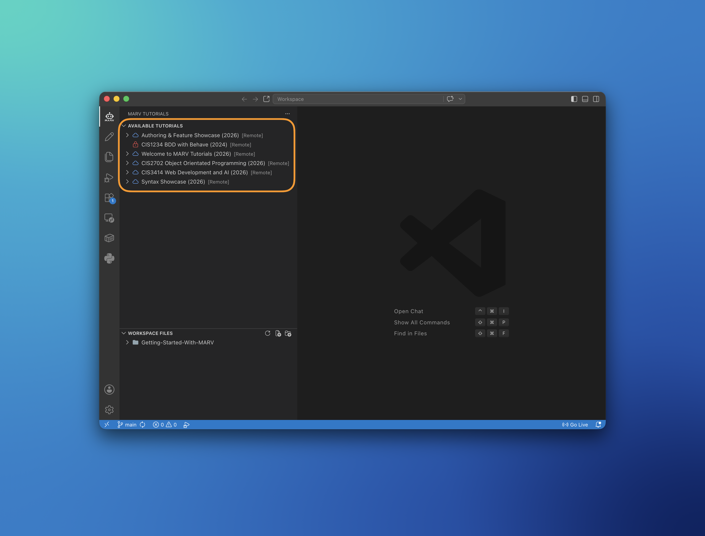

==================================================
MARV Platform & Getting Started Documentation
==================================================

Welcome to the official **MARV** (*Managed Activities, Review, and Validation*) documentation portal. MARV is an integrated platform designed for building and experiencing interactive developer education directly within Visual Studio Code.

.. note::
   **Quick Start:** Begin with the :doc: section to install the MARV VS Code extension and configure your API URL.

------------------
Platform Overview
------------------

MARV bridges the gap between educational instructions and practical coding. Instead of context-switching between external web browsers, static documentation, and code editors, MARV delivers tutorial modules directly inside VS Code.

Key Features & Workflow
-----------------------

**VS Code Integration:** Native sidebar viewer pane with auto-synchronized navigation.

**Simple Installation:** Manual VSIX extension setup directly within VS Code.

**API Configuration:** Direct connection to institution API servers.

**Student Identification:** Integrated student ID configuration for tracking progress.

**Hierarchical Structure:** Clear ``Module`` → ``Tutorial`` → ``Page`` organization.

**Workspace Integration:** Native workspace folder linking for developer education.

-------------------
Documentation Tree
-------------------

.. toctree::
   :maxdepth: 2
   :caption: Getting Started Guide:

   getting_started/index
   getting_started/01_about
   getting_started/02_installation
   getting_started/03_api_setup
   getting_started/04_student_id
   getting_started/05_interface
   getting_started/06_workspaces

.. toctree::
   :maxdepth: 2
   :caption: Reference & Support:

   reference/index
   reference/cheat_sheet
   reference/troubleshooting
